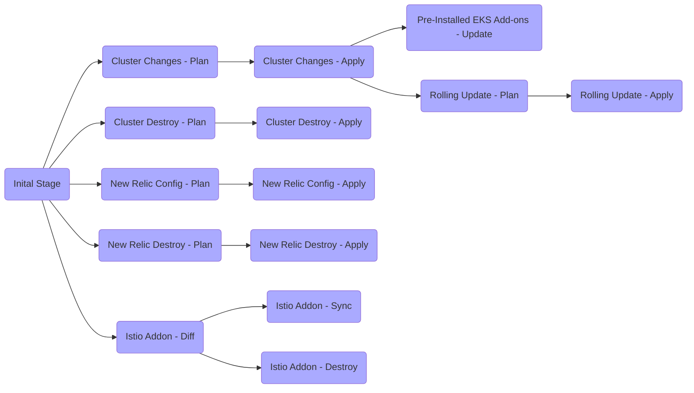

# EKS Cluster with default add-ons

### Pre-requisites
* AWS access for creation of EKS
* An AWS account
* AWS CLI, Helm, Helm Plugins, Kubectl, Terraform, and Terragrunt installed (manual installation)

_Note: You can consider using [asdf](https://github.com/asdf-vm/asdf) a runtime management tool_


### Requirements
| Name | Version |
|------|---------|
| <a name="requirement_aws"></a> [aws](#requirement\_aws) | >= 2.60.0 |
| <a name="requirement_helm"></a> [helm](#requirement\_helm) | >= 3.0 |
| <a name="requirement_helmPlugin"></a> [Helm Plugin -diff](#requirement\_helm) | >= 3.1.3 |
| <a name="requirement_helmPlugin"></a> [Helm Plugin -git](#requirement\_helm) | >= 0.10.0 |
[kubernetes](#requirement\_kubernetes) | ~> 1.9 |
[kubectl](#requirement\_kubectl) | ~> 1.18 |˜
| <a name="requirement_terraform"></a> [terraform](#requirement\_terraform) | >= 1.0.3 |
| <a name="requirement_terragrunt"></a> [terragrunt](#requirement\_terragrunt) | >= 0.28.21 |

#### Default folder structure.
```bash
examples/wh-eks-standard/
├── .gitlab-ci.yml
├── .tool-versions
├── README.md
├── helmfile
│   ├── .gitlab-ci.yml
│   ├── envs
│   │   └── sit
│   │       └── override.yml
│   └── helmfile.yaml
├── scripts
│   ├── .gitkeep
│   ├── apply-helm-chart-crds.sh
│   ├── cni-annotate-and-label.sh
│   ├── coredns_upgrade.sh
│   ├── kubeproxy_upgrade.sh
│   └── nodegroup_upgrade.sh
└── terragrunt
    ├── .gitlab-ci.yml
    ├── common.hcl
    └── dev
        └── eu-west-1
            └── sample-eks01
                ├── newrelic
                │   └── terragrunt.hcl
                └── terragrunt.hcl
```

### Outline
- Part 0 - Copy the folder structure
- Part 1 - Update channel Terragrunt file
- Part 2 - Update channel Helm configuration file
- Part 3 - gitlab-ci updates (CI)
- Part 4 - Build AWS EKS Infrastructure and deploy addons (CI)
- Part 5 - Build AWS EKS Infrastructure (manual)
- Part 6 - Connect the EKS Cluster (manual)
- Part 7 - Install Istio with default EKS add-ons (manual)
- Part 8 - Test installation of the add-ons (manual)
- Part 9 - Destroy the Helm charts installed (manual)
- Part 10 - Destroy the EKS Cluster (manual)
- Part 11 - Update NewRelic Terragrunt file
- Part 12 - Create New Relic policy and alerts (manual)
- Part 13 - Destroy New Relic policy and alerts (manual)

#### Part 0 - Copy the folder structure
Make sure, to replicate the folder structure or simply copy all the files (current directory) to your channel specific repository.

#### Part 1 - Update channel Terragrunt file
There are two Terragrunt configuration files for each environment build.
- `common.hcl` - It contains the global default terragrunt configurations like terraform s3 state, list of tags created, list of IAM roles created for addons etc. Those will be applied across all your aws accounts specified in the `/terragrunt` directory.
- `terragrunt.hcl` - List of ASGs created for OnDemand and Spot instances and their configurations. Specific for given cluster.

The list of default variables that needs replacement in the channel Terragrunt file.

```bash
channel             = "platform-eng"
product             = "eks"
compliance          = "ncde"
common_infra_role   = "williamhill-delegated-write"
org                 = "wh"
infra_org           = "wh"
escalation          = "awsteam@williamhill.co.uk"
cost_center         = "GR0175"
owner               = "TechOps"
subdivision         = "TechOps"
tier                = "Internal"
approval            = "samplecluster"
```

Default AutoScaling Group configuration can be set through below parameters (keep desired and min capacity always as 1):

```bash
#1. ###################### Default OnDemand ASGs Settings ##########################################
on_demand_instance_type       = "m5.large"
asg_desired_capacity          = 1
asg_min_size                  = 1
asg_max_size                  = 10

#2. ###################### Default Spot ASGs Settings ##########################################
spot_asg_desired_capacity     = 1
spot_asg_min_size             = 1
spot_asg_max_size             = 64
spot_instance_pools           = 1
```

Autoscaling group configuration for the nodes can be extended through configuring `custom_asg_groups`:

```bash
custom_asg_groups = [
######### 1. Creates OnDemand Custom ASG
{
  name                 = "OnDemand-Custom-ASG01-"
  instance_type        = "m5.large"
  asg_desired_capacity = 1
  asg_min_size         = 1
  asg_max_size         = 3
  kubelet_extra_args   = "--node-labels=lifecycle=OnDemand-Custom-ASG01"
  suspended_processes  = ["AZRebalance"]
  tags =  concat([
    {
    "key"                 = "SampleTag"
    "value"               = "tag01"
    "propagate_at_launch" = "true"
    },
    {
    "key"                 = "SampleTag2"
    "value"               = "tag02"
    "propagate_at_launch" = "true"
    }
  ],
  local.additional_worker_node_asg_tags
  )
},
######### 2. Creates Spot Instance Custom ASG -1
{
  name                    = "Spot-Custom-ASG01-"
  override_instance_types = [
    "m5.large",
    "m5a.large",
    "m5d.large",
    "m5ad.large"
  ]
  spot_instance_pools  = 1
  asg_desired_capacity = 1
  asg_min_size         = 1
  asg_max_size         = 4
  kubelet_extra_args   = "--node-labels=lifecycle=Spot-Custom-ASG01"
  tags = local.additional_worker_node_asg_tags
},
######### 3. Creates Spot Instance Custom ASG -2
{
  name                    = "Spot-Custom-ASG02-"
  override_instance_types = [
    "m5.large",
    "m5ad.large"
  ]
  spot_instance_pools  = 1
  asg_desired_capacity = 1
  asg_min_size         = 1
  asg_max_size         = 5
  kubelet_extra_args   = "--node-labels=lifecycle=Spot-Custom-ASG02"
  tags = local.additional_worker_node_asg_tags
}
]
```

#### Part 2 - Update channel Helm configuration file

There is a minimal set of variables that needs to be specified for EKS addons deployment, plus additional values depending on enabled/installed addons.

Following file, represents example addons configuration for SIT. Make sure to update all the global variables to match your environment.

`/helmfile/envs/sit/override.yml`:
```bash
centralAddons:
  global:
    awsAccountId: 929049687855
    awsRegion: eu-west-1
    channel: cpe
    clusterName: sample-eks01
    domain: sample-eks01.platform-eng.aws-ew1.dv.williamhill.plc
    env: dev
    newRelicLicenseKey: AXXYYUUSDSD-DSDSD    # Or if you have in an SSM parameter can use ref+awsssm:///common/newrelic_license_key
    subnetIds: "subnet-03a60acfxxxxxxxx, subnet-03a60acfyyyyyyyyyy, 03a60acfzzzzzzzzzzz" # Or if you have in an SSM parameter can use ref+awsssm:///common/subnet_ids

  charts:
    splunkKubernetesLogging:
      values:
        splunk:
          hec:
            indexName: wh_cpe                # See https://conf.willhillatlas.com/display/CP/Splunk
            token: ABCD-EFGH                 # Or if you have in an SSM parameter can use ref+awsssm:///common/splunk_token
```

Note: 

the `subnetIds` parameter is not required if you decide to not install AWS Load Balancer Controller. In that case, you will have to take care for tagging the load balancer target subnets accordingly to https://aws.amazon.com/premiumsupport/knowledge-center/eks-vpc-subnet-discovery/.

The key helmfile configuration file has following pattern:

`/helmfile/helmfile.yaml`:
```bash
environments:
  <env>:
    values:
    - envs/<env>/override.yml

helmfiles:
- path: git::https://gitlab.com/williamhillplc/platform-engineering/cpe/playground/eks-setup.git@helmfile/helmfile.d/?ref=<tag>
  values:
  - git::https://gitlab.com/williamhillplc/platform-engineering/cpe/playground/eks-setup.git@helmfile/default-values.yaml?ref=<tag>
  - {{ toYaml .Values |  nindent 4 }}
```

It is a place where you can start adding you own helmfile releases and environments if you decide so.

**Note**:
- `env` - specifies the environment on which EKS created
- `values` - specifies the default Helmfile values used for all the charts
- `tag` - git release tag - [refer - Latest Helm charts Version](README.md)


From this point you can either go with CI based deployment or manual process.
If you consider manual process skip parts 3 and 4, and go to part 5 directly.

#### Part 3 - gitlab-ci updates

Update the `.gitlab-ci.yml` files:
* `.gitlab-ci.yml`
* `helmfile/.gitlab-ci.yml`
* `terragrunt/.gitlab-ci.yml`

Make sure to check the values for:
- `tags`
- `aws_account_name`
- `cluster`
- `region`

Look for `tags` as job will be executed on the runner that is labeled by this tag. 
If you deploy [gitlabRunner addon](https://gitlab.com/williamhillplc/platform-engineering/cpe/playground/eks-setup/-/tree/master/docs/addons/gitlab-runner.md) (not deployed by default) it will provision gitlab runner in your EKS cluster. 
That runner has by default tag set to:

    {{ $defaultRunnerTag := printf "%s-aws-kubernetes-%s-%s-%s" $channel $env $awsRegion $clusterName }}

which equals `platform-eng-aws-kubernetes-dev-eu-west-1-sample-eks01` in case clusterName is sample-eks01, provisioned in eu-west-1 region.

If you are using a custom AWS VPC CNI, then you should
- Enable the addon and configure in the override file
- Enable the helmfile/.gitlab-ci.yml file's execution of ./scripts/cni-annotate-and-label.sh

Additionally, consider renaming stages and actions in your CI file to reflect account and cluster name, e.g. `dev-sample-eks01`.

_Note: If you decide to update CI cluster name, account name or region, make sure to reflect those changes in your `/terragrunt` directory._


#### Part 4 - Build AWS EKS Infrastructure and deploy addons (CI)

Once you commit above changes to repository, gitlab ci pipeline should start running.
Go to your repository pipeline and check if your pipeline is running.
Proceed with manual approvals after each stage.


### CI Flow
CI Pipeline contains below three main stages
1. EKS Build and destroy
2. Install `istio` and `default` add-ons
3. Upgrade EKS worker groups and NodeGroups
4. Configure New Relic Monitoring





_Note: approve destroy stages only when applicable. When deleting your cluster, run destroys in the reverse order._

_Voila, you are all done!_

#### Part 5 - Build AWS EKS Infrastructure (manual)
Build the EKS cluster `sample-eks01` on `dev` account at `eu-west-1` region by running below command.

```bash
cd examples\wh-eks-standard\terragrunt\dev\eu-west-1\sample-eks01
terragrunt plan
terragrunt apply
```
The stack creates AWS EKS `v1.18` with default `3` OnDemand and `3` Spot instances, one in each `AZ`.


#### Part 6 - Connect the EKS Cluster (manual)
Once the EKS cluster build successfully, run the following command to connect to the cluster.

```bash
aws eks update-kubeconfig --name sample-eks01 --region eu-west-1

kubectl get pods -A
```

#### Part 7 - Install EKS add-ons (manual)
Once after a successful connection to the `sample-eks01` EKS cluster, run the following command to install `istio` and default `addons`.

```bash
cd examples\wh-eks-standard\helmfile\
helmfile -e sit deps
helmfile -e sit diff --skip-deps
helmfile -e sit apply --skip-deps
```

Note: You may need to have adopted the AWS VPC CNI resources, if the addon is enabled

By default, `istio` will install with version `1.11.1` with `one` ingress controller (internal). This are the list of addons that will be installed by `default.`
* aws-load-balancer-controller
* aws-privateca-issuer
* aws-node-termination-handler
* aws-vpc-cni
* cert-manager
* cert-manager-config
* cluster-autoscaler
* external-dns
* istio-base
* istio-config
* istio-discovery
* istio-ingress
* kiali-config
* kiali-server
* kube-prometheus
* kube-prometheus-config
* kube-state-metrics
* metrics-server
* newrelic-infrastructure
* nri-kube-events
* nri-metadata-injection
* splunk-kubernetes-logging

These are the default priority sets for `cluster-autoscaler` for scaling the ASGs.
```bash
apiVersion: v1
kind: ConfigMap
metadata:
  name: cluster-autoscaler-priority-expander
  namespace: kube-system
data:
  priorities: |-
    100:
      - .*spot.*
    0:
      - .*
```

#### Part 8 - Test installation of the add-ons (manual)
The `tests` directory in this repository contains a set of simple tests, that can be used to test if the add-ons have been installed correctly. Refer to `tests/README.md` in this repo for further steps on testing the add-ons.

#### Part 9 - Destroy the Helm charts installed (manual)

It is important to remove helm charts before deleting the cluster, as there might be danglings Load Balancers and Target Groups otherwise.g
```bash
cd examples\wh-eks-standard\helmfile\
helmfile -e sit destroy
```


#### Part 10 - Destroy the EKS Cluster (manual)
```bash
cd examples\wh-eks-standard\terragrunt\dev\eu-west-1\sample-eks01
terragrunt plan -destroy
terragrunt destroy
```

#### Part 11 - Update NewRelic Terragrunt file
A default terragrunt file is created for NewRelic `dev` environment, making the default New Relic policy and alerts.
The list of default variables that needs replacement in the New Relic Terragrunt file.

```bash
  cluster_name = "platform-eng-dev-eu-west-1-sample-eks01"
  infra_org    = "wh"
  channel      = "platform-eng"
  env          = "dev"
  aws_region   = "eu-west-1"
  stack_name   = "newrelic"
  product      = "eks"
  subdivision  = "TechOps"
  tier         = "Internal"

## variables
  newrelic_api_key   = "ASDSDSDD"
  newrelic_account_id = "123455"
  slack_webhook_url  = "https://hooks.slack.com/services/T02D11B4K/B028XBK2L2E/GJo2fxTHhZ77"
```
***Note:***
* Needed Terraform version atleast v0.14
* List of default New Relic alerts configured as listed [here](https://gitlab.com/williamhillplc/platform-engineering/cpe/playground/eks-setup/-/tree/master/terraform#list-of-alerts-configured)
* By default it will create below list of things
  - default policy with standard - `ProductEKS-Default-Policy-<channel-name>-<env>-<region>-<clustername>`
  - notifications channels like `slack`, `email` and `pagerduty`
  - default kubernetes NewRelic dashboard can be accessed using GUI - `Infrastructure` -> `Third-party services` -> `kubernetes dashboard`

#### Part 12 - Create New Relic policy and alerts (manual)
```bash
cd examples\wh-eks-standard\terragrunt\dev\eu-west-1\sample-eks01\newrelic
terragrunt plan
terragrunt apply
```

#### Part 13 - Destroy New Relic policy and alerts (manual)
```bash
cd examples\wh-eks-standard\terragrunt\dev\eu-west-1\sample-eks01\newrelic
terragrunt plan -destroy
terragrunt destroy
```

**Note**:
You can refer the process of patching or upgrading the EKS clusters using the [link](https://gitlab.com/williamhillplc/platform-engineering/cpe/playground/eks-setup/-/blob/master/docs/MAINTENANCE.md).
